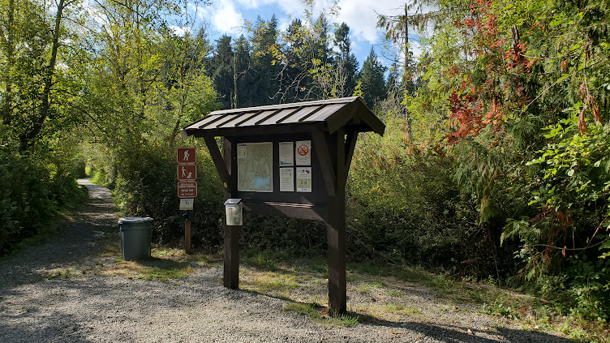

# Andrew Pan

### MSECE at Carnegie Mellon University

### andrewlpan [at] gmail.com

Hi!

I'm a student at CMU in the Masters of Electrical and Computer Engineering program. My interests are in computer architecture and VLSI. 

### Some fun projects I've done

